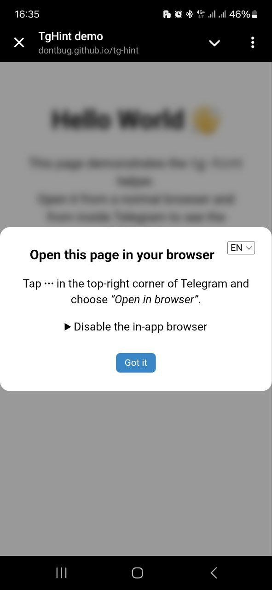
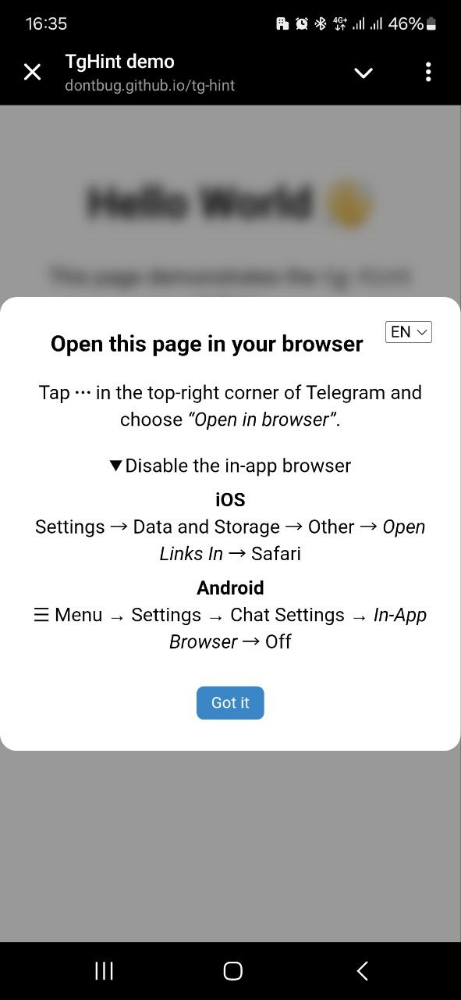

# Telegram In-App Browser Helper

[](https://dontbug.github.io/tg-hint/)
[](https://www.npmjs.com/package/tg-hint)


This 3 kB script detects when your page is opened *inside* Telegram and
pops up a short instruction telling the user how to open it in their
regular browser (⋯ → **Open in browser**).

* **Auto-detects** Mini App, legacy `TelegramWebviewProxy`, and UA strings
* **Multilingual** – picks the device language, plus a language switcher
* **One-click dismiss**
* Built-in guide for turning the Telegram WebView off (iOS & Android)

---

## Quick look

<p align="center">
  
  &nbsp;
  
</p>

*(Try it live on the [demo page »](https://dontbug.github.io/tg-hint/))*

## Install

```html
<!-- Production — jsDelivr CDN -->
<script src="https://cdn.jsdelivr.net/gh/dontbug/tg-hint/dist/tg-hint.min.js"></script>
```
or with npm / pnpm:
```bash
npm i tg-hint
# then in your code
import 'tg-hint';
```

---

## ☕ Support

If this project saved you a couple of hours, you can **buy me a coffee** – thank you!

[](https://www.buymeacoffee.com/dontbug)

